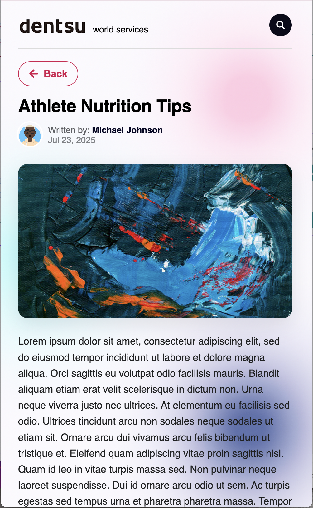
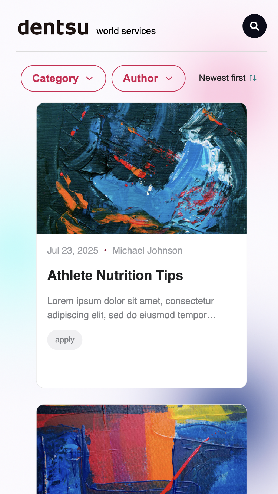

<h1>DWS Project</h1>

<h3>Description</h3>

This is a *take-home* project built with [React](https://reactjs.org/) and Redux Toolkit, following the instructions provided for this stage of the process, and consuming the given API.

The goal is to demonstrate modern frontend development skills with React, implementing all the requested requirements:

✅ Home page with a list of posts and category/author filters  
✅ Sort filter to view posts from newest to oldest  
✅ Search page with dynamic results  
✅ Post page with full content and related data  
✅ API consumption with DWS data integration  
✅ Test with RTL and Vitest

👉 [Check out the live project](https://dws-blog-black.vercel.app/)

<p align="center">
  <figure style="display:inline-block; margin:10px;">
    <figcaption align="center"><strong>App</strong></figcaption>
    
  </figure>
  
  <figure style="display:inline-block; margin:10px;">
    <figcaption align="center"><strong>Post Details</strong></figcaption>
  </figure>
    
    
  <figure style="display:inline-block; margin:10px;">
    <figcaption align="center"><strong>Mobile</strong></figcaption>
    
    
  </figure>
</p>


## Highlights  

- Redux Toolkit for global state management  

- React Query for efficient API data fetching and caching  

- Styled buttons  

- CSS for styling and responsiveness  

- DWS API as the data source
  
- Tests using RTL and Vitest

---

## 🚀 How to run the project locally

```bash
npm install
npm run dev
```

## Environment Variables

Create a .env file with the following variable:
```bash
OPENAI_API_KEY=
```


Then access: http://localhost:3000

<h2>📌 Improvements</h2>
- The code can be refactored by removing components that became unnecessary, such as parts of the Context.

<h2>📌 Discussion Points</h2> 
- Some project instructions could have been more specific, such as the absence of a "clear filters" button on desktop version.
